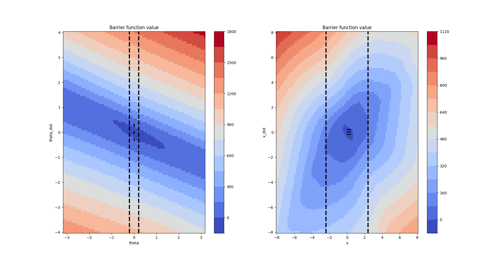
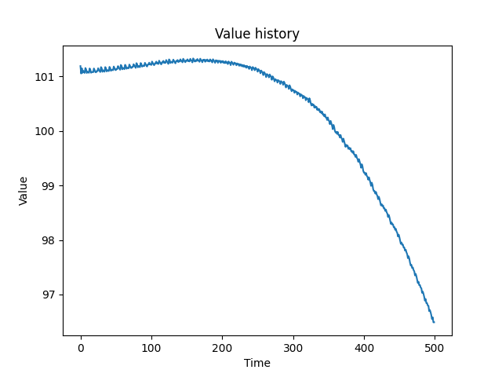
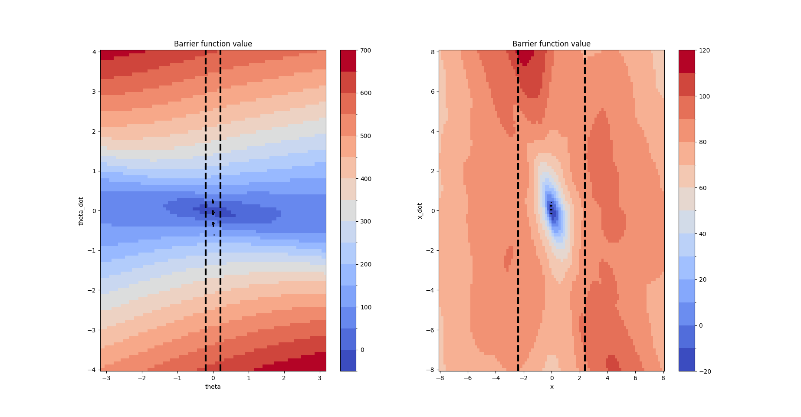
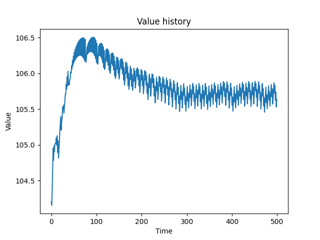

# Supervised Losses

We add a supervised loss on the unsafe states 

The supervised loss has the effect of enforcing the barrier condition

## Figures

Compare with and without the supervised loss:

Without:

With:

## Videos

See respective `checkpoints/xxxx/rollout.mp4` 

Checkpoint trained with supervised loss: `vgdae80s`

Checkpoint trained without supervised loss: `yp8twvo`

The checkpoint trained with supervised loss is clearly more stable
